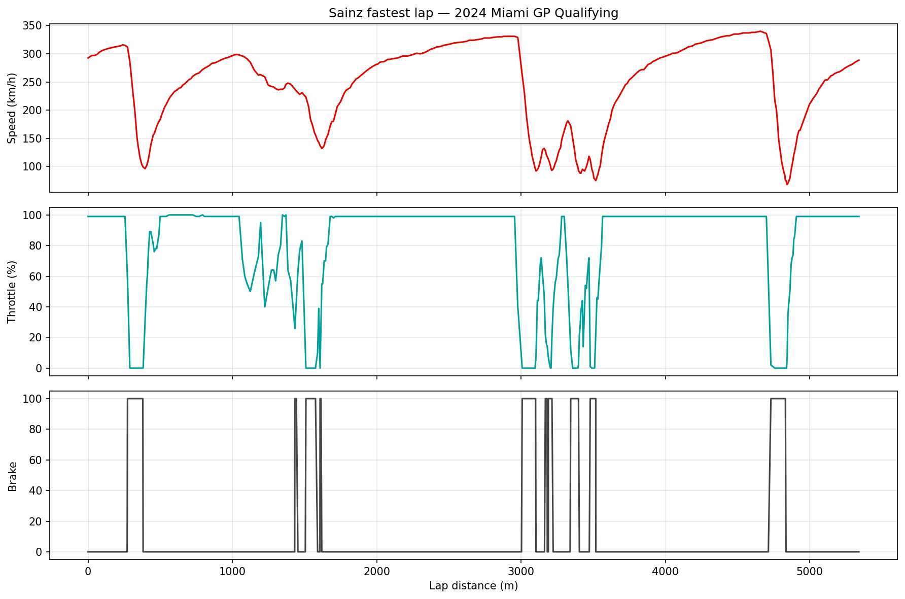
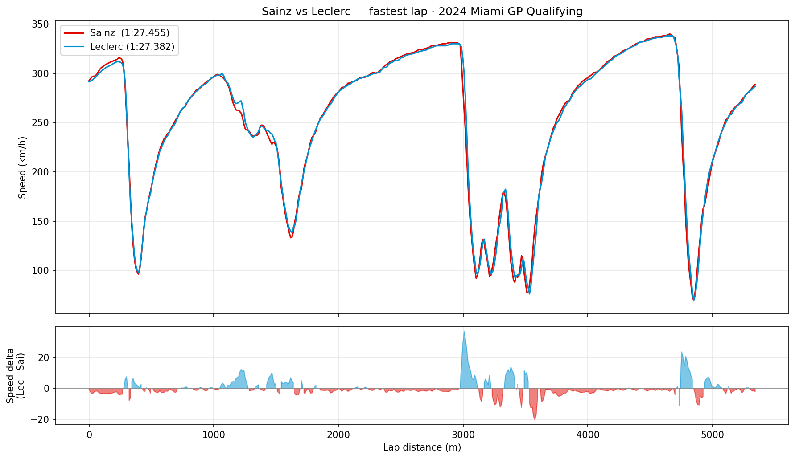
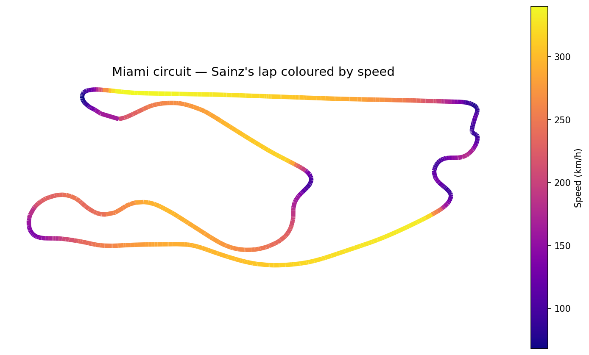

# F1 Telemetry Analysis — 2024 Miami GP Qualifying

Telemetry analysis of the two Ferrari drivers' fastest qualifying laps at the
**2024 Miami Grand Prix** — Carlos Sainz vs Charles Leclerc — built in Python
with data from the official Formula 1 timing feed (via the
[FastF1](https://docs.fastf1.dev/) library).

Same car, two drivers: a clean way to see where lap time is actually won and lost.

## Key finding

Leclerc set a **1:27.382**, Sainz a **1:27.455** — a gap of just **0.073 s**
between teammates in identical machinery. The speed-delta trace pinpoints exactly
where that gap opened up.

## Analysis

### 1. Sainz — lap telemetry
Speed, throttle and brake across the full lap: brake points into the slow corners
and full-throttle pulls down the straights.

### 2. Sainz vs Leclerc
Both speed traces overlaid, with the speed delta below.
**Blue** = Leclerc faster, **red** = Sainz faster.

### 3. Miami circuit — speed map
The racing line reconstructed from car position (X, Y) and coloured by speed.

## Tech stack
- **Python** — pandas, NumPy, matplotlib
- **Data** — FastF1 (official F1 timing & telemetry)

## Data
`miami2024_q_sainz_leclerc.csv` — fastest-lap telemetry for both drivers:
distance, speed, throttle, brake, gear, RPM and track position (X, Y).

## How to run
1. Open `f1_miami_telemetry.ipynb` in Google Colab or Jupyter.
2. Upload `miami2024_q_sainz_leclerc.csv`.
3. Run the cells top to bottom to reproduce the three figures.

## Author
**José Leonardo Guerrero Metlich** — Mechatronics Engineering student,
Tecnológico de Monterrey. Aspiring Formula 1 performance / software engineer.
